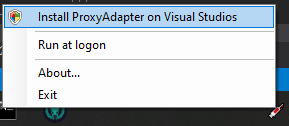
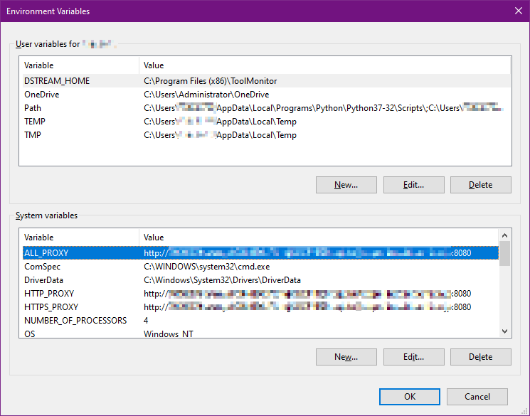

# Proxy adapter for Visual Studio (2012, 2013, 2015, 2017 and 2019)


This is HTTP proxy adapter for Visual Studio. It has ability for applying HTTP proxy settings retreive from the environment variable `HTTP_PROXY` or likes.
The manner is likely unix-style, so your unix based tools (Git, MinGW and also) better fitting usages.

It'll resident onto task tray, and you can quickly install only double clicking the icon when you'll each update Visual Studio :)

## How to use

[Download pre-built binary (ver0.8.1)](https://github.com/kekyo/VisualStudioProxyAdapter/releases/download/0.8.1/ProxyAdapterInstaller-0.8.1.zip)

Execute ProxyAdapterInstaller.exe, then it shows a syringe icon on task tray. You can double click or choice "Install ProxyAdapter on Visual Studios" context menu for showing right clicked. (Require elevated administrative privilege because will copy ProxyAdapter files and fix configration for installed Visual Studios.)



Installation completed!

### Optional: Manually installation steps

(This installation steps are manually if you wanna do. You can understand what to do ProxyAdapterInstaller.)

1. Place ProxyAdapter.dll into your Visual Studio IDE environment folder like:
`C:\Program Files (x86)\Microsoft Visual Studio\2017\Professional\Common7\IDE\`

2. Edit devenv.exe.config. it's very large xml file, you can see the element `<system.net>` at the bottom of xml:

```xml
    <system.net>
      <settings>
        <ipv6 enabled="true"/>
      </settings>
    </system.net>
```

Insert proxy entries:

```xml
    <system.net>
      <!-- Insert below -->
      <defaultProxy enabled="true" useDefaultCredentials="false">
        <module type="ProxyAdapter.FromEnvironment, ProxyAdapter"/>
      </defaultProxy>
      <!-- Insert above -->
      <settings>
        <ipv6 enabled="true"/>
      </settings>
    </system.net>
```

### Set environment variables after installed

Ready to use, you have to add environemnt variables be able to named `HTTPS_PROXY`, `HTTP_PROXY` and/or `ALL_PROXY` (Will fallback these names). You may know these're standard unix-like proxy assignment solution.

Format example: `http://<proxyUser>:<proxyPassword>@proxy.example.com:8080`



## License

Apache-v2
